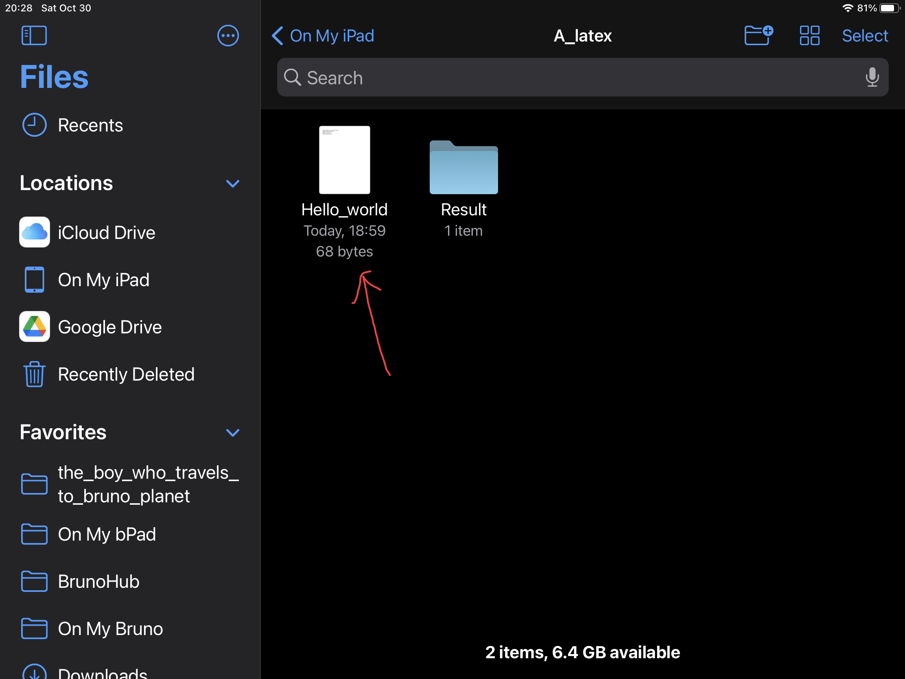
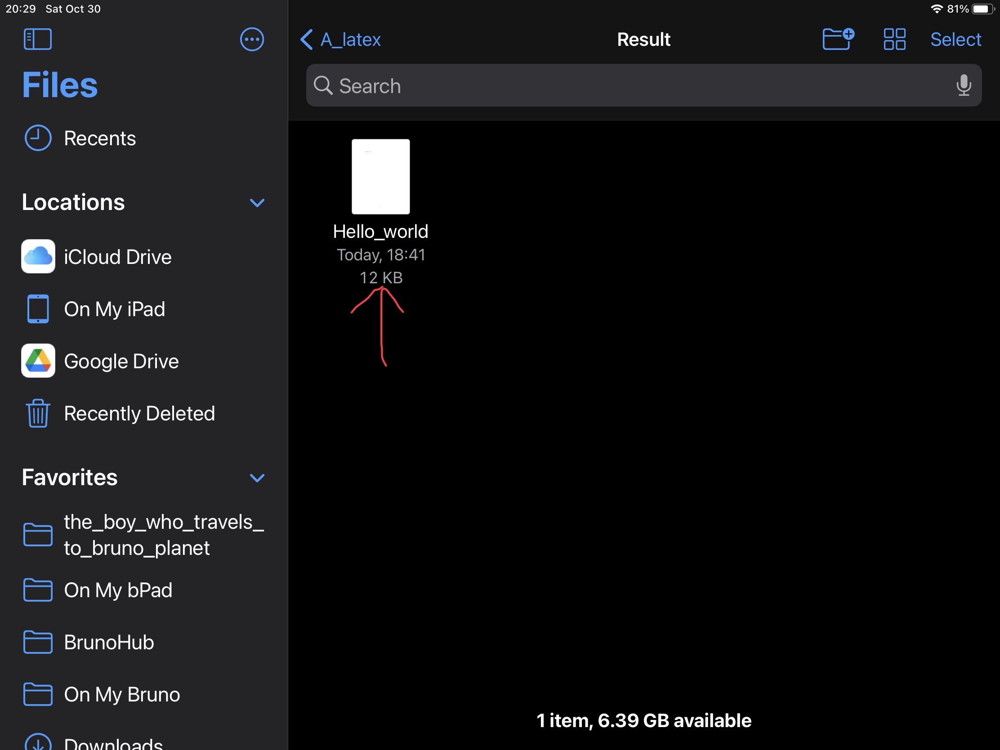

# LaTeX

On this page:
- [Prerequistes](#prerequistes)
- ["Hello, world!"](#hello-world)
  - [Steps](#steps)
- [Equation Document](#equation-document)

## Prerequistes

You will need:

- An iPad (iPadOS 13 or later), iPhone (iOS 13 or later), iPod touch (iOS 13 or later), or Mac (macOS 11 or later with an Apple M1 chip)
- LaTeX Editor Tex Pro (an app)

## "Hello, world!"

On this lesson, you will learn how to make a LaTeX file...



...into a PDF!



### Steps

First, create a new .tex file. Don't forget to name it!


Secondly, look at what your file says. It should say:

```latex
\documentclass{article}
\begin{document}
My first \LaTeX~document!
\end{document}
```

Change it to say:

```latex
\documentclass{article}
\begin{document}
Hello world!
\end{document}
```

Then, press the eye (👁️) button to see your preview! Oops, silly me. You should've pressed the arrow button (a.k.a. build button) first.


It should still say "My first LaTeX document." Don't worry. Click "save!"

Finally, open your PDF file (not in the Tex Pro app.) If you still see "My first LaTeX document," you can [borrow one from me!](Hello_world.pdf)

## Equation document

### Part 1: Addition and subtraction

Name your file "equations." You should still see:

```latex
\documentclass{article}
\begin{document}
My first \LaTeX~document!
\end{document}
```

Change it to say:

```latex
\documentclass{article}
\begin{document}
My first addition statement:
$$x + y$$
My fist subtraction statement:
$$x - y$$
\end{document}
```

Then click the build button and then the eye. You should see:


Save the document, and then open it! This is what you should see.
